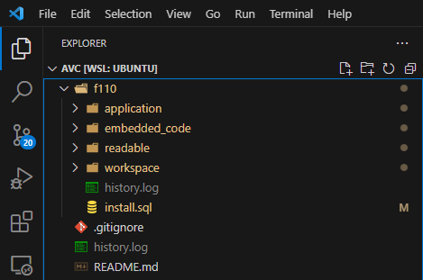
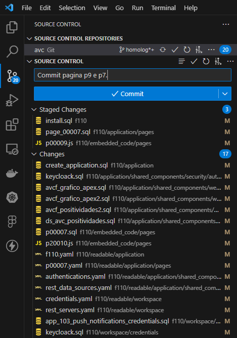
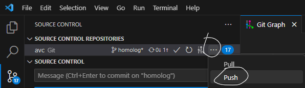

# Versionamento e Deploy Apex com GitLab

Versionamento do Oracle Apex no GIT ou GIT LAB.

Para este versionamento iremos utilizar a seguinte stack:

- Docker
- SQLcl
- Visual Studio Code
- LiquidBase
- Git

O processo de versionamento acava sendo muito simples, o processo de CI/CD acaba entrando neste mesmo "pacote" de simplicidade.

# Exportacao dos dados

Para exportar os dados do Apex, existem N's formatos, o melhor dele em um cenario de versionamento via GIT contendo CI/CD acaba sendo via SQLcl.

Para isto, iremos subir um container no Docker utilizando SQLcl:

```
docker run --rm -it -v ./:/opt/oracle/sql_scripts container-registry.oracle.com/database/sqlcl:latest USER/PASSWORD@DNS:1521/SERVICE_NAME
```

Este comando acima, ira criar um container com ultima versao do SQLcl, conectado no banco de dados setado.

O comando acima, mapeia para o container a pasta no qual esta sendo executado o comando, ou seja, caso voce esteja na pasta _/home/mateus-bodanese/testes/_ ele ira exportar os dados dentro da pasta TESTES, pois foi criado um volume com o ``` -v ./```.

Feito isto, podemos executar o comando ``` apex help``` para obter comandos que podem ser executado.

```
SQL> apex help

  Usage: 
  apex|ax COMMAND {OPTIONS}
  apex|ax  help|he [-example|-ex]
  apex|ax  help|he COMMAND [-syntax|-sy] [-example|-ex]

  The following commands are available within the apex feature.

  Commands:
    export|ex
    Export APEX applications and or workspaces. 

    export-all-applications|exaa
    Export all applications in a workspace

    export-all-workspaces|exaw
    Export all workspaces without there applications, structure only.

    export-application|exap
    Export all or the parts of an application

    export-components|exco
    Export specific components within an application

    export-feedback|exfe
    Export workspace feedback 

    export-instance|exin
    Export all applications in all workspaces that are not hidden

    export-static-files|exsf
    Export static files in a workspace

    export-workspace|exwo
    Export workspace without the applications, structure only.

    list|li
    Generate a list of available components
    
```

Para saber qual applicacao iremos exportar, vamos executar o comando ``` apex list ```

```
SQL> apex list

WORKSPACE_ID        WORKSPACE    APPLICATION_ID    APPLICATION_NAME    BUILD_STATUS       LAST_UPDATED_ON  
2044838282373994    AVCF         110               Aves Campo          Run and Develop    08-DEC-23      
```
Ou seja, para exportar iremos usar os seguintes comandos:
```
apex export -applicationid 110 -workspaceid 2044838282373994 -split -skipExportDate -expOriginalIds -expSupportingObjects Y -expType APPLICATION_SOURCE,READABLE_YAML,EMBEDDED_CODE
```

Apos exportar, na pasta onde criamos o volume teremos o seguinte resultado:




Para realizar o versionamento no Git, eu particularmente uso o VSCode, pela simplicidade, para versionar basta eu ir ate ``` Source Control -> Selecionar os arquivos -> Adicionar uma menssagem -> Commit -> Sync os dados```





A partir deste momento, ja temos nosso codigo versionado no Git, agora para verificar oque foi mudado, se deu conflito ou nao, para isto, usamos o Git Flow, onde o proprio Git fica responsavel por controlar Merge e  Conflitos.

# Configuracao do CI/CD

Para configurar o CI/CD (Continuous Integration/Continuous Delivery), iremos internamente no git, criar um arquivo chamado ```.gitlab-ci.yml``` onde ele sera o responsavel por realizar a ```instalacao``` no ambiente produtivo.

```

#  Author: Mateus G. Bodanese
#  Since: 23/11/2023

image: docker:dind

services:
  - docker:dind

variables:
  DOCKER_TLS_CERTDIR: ""
  DOCKER_DRIVER: overlay2 
  
stages:
    - deploy

.job-template: &script_template
  script:
    - docker run -d --rm -it -v ./f110:/opt/oracle/sql_scripts container-registry.oracle.com/database/sqlcl:latest SEU_USUARIO/SUA_SENHA@DNS_DESTINO:1521/SERVICE_NAME @install.sql

producao:
  stage: deploy
  environment:
    name: producao
  variables:
    ENV: "producao"
  only:
    - tags
  when: manual
  <<: *script_template

```

Explicando brevemente o arquivo, usamos a image docker:dind que é uma imagem que possui o Docker dentro dela para permitir a execução de containers Docker durante o pipeline.

Variables: Define variáveis de ambiente que podem ser usadas em todo o pipeline. Neste caso, estão configurando duas variáveis:
```
DOCKER_TLS_CERTDIR: Definida como uma string vazia, o que geralmente desabilita a autenticação TLS do Docker.
DOCKER_DRIVER: Define o driver de armazenamento do Docker como "overlay2"
```

Como versionamos a pasta f110 no git, precisamos subir ela inteira para o SQLcl conseguir ler todos os arquivos, por isto usamos ```./f110```, ja o APEX no exporta um arquivo chamado ```install.sql``` que ele faz todo o ```deploy``` automaticamente para nos, sem precisamos rodar comando por comando.

Portanto, o deploy acaba sendo muito simples, pois apenas precisamos subir o docker com SQLcl conectado na base de destino e mapear os arquivos necessarios.

Porem, apenas criar o arquivo nao basta, precisamos dizer para o Git, que na pipeline ele precisa realizar o uso do arquivo que criamos, para isto, vamos ate ``` Settings -> CI/CD -> General pipelines ```, no campo CI/CD configuration file informamos o caminho do ```.gitlab-ci.yml```, como por exemplo ```my/path/.gitlab-ci.yml```.

Pronto, agora basta realizar as configuracoes de pipeline, se ela sera automatica, manual e quais seriam as regras de versionamento.
